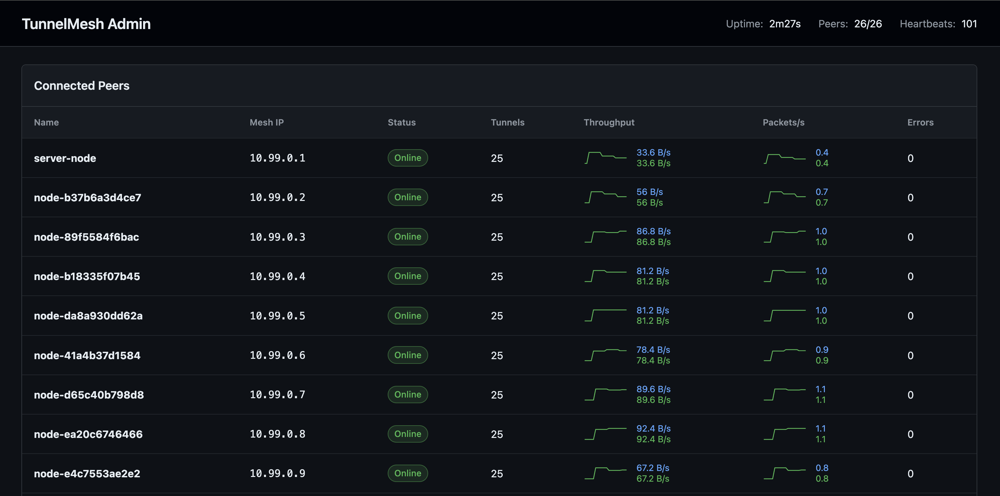

# TunnelMesh

A peer-to-peer mesh networking tool that creates encrypted tunnels between nodes using SSH. TunnelMesh enables direct, secure communication between peers in a distributed topology without requiring a traditional VPN or centralized traffic routing.

## Features

- **P2P Encrypted Tunnels** - Direct connections between peers using pluggable transports
- **Pluggable Transport Layer** - Supports SSH, UDP (WireGuard-like), and WebSocket relay transports with automatic fallback
- **Coordination Server** - Central hub for peer discovery, IP allocation, and NAT traversal coordination (not a traffic router)
- **TUN Interface** - Virtual network interface for transparent IP routing
- **Built-in DNS** - Local resolver for mesh hostnames (e.g., `node.tunnelmesh`)
- **Network Monitoring** - Automatic detection of network changes with re-connection
- **NAT Traversal** - UDP hole-punching with STUN-like endpoint discovery, plus relay fallback
- **Multi-Platform** - Linux, macOS, and Windows support
- **Admin Dashboard** - Web interface showing mesh status, peers, traffic statistics, and per-peer transport controls
- **Server-as-Client** - Coordination server can also participate as a mesh node
- **High Performance** - Zero-copy packet forwarding with lock-free routing table



## Getting Started

For a complete step-by-step setup guide including downloading releases, configuring servers and peers, and installing as a system service, see the **[Getting Started Guide](docs/GETTING_STARTED.md)**.

## Architecture

```
┌─────────────────┐                      ┌─────────────────┐
│   Peer Node A   │                      │   Peer Node B   │
│   (10.99.0.1)   │                      │   (10.99.0.2)   │
│                 │  Encrypted Tunnel    │                 │
│  ┌───────────┐  │◄────────────────────►│  ┌───────────┐  │
│  │ TUN Device│  │  (SSH/UDP/Relay)     │  │ TUN Device│  │
│  │  Router   │  │                      │  │  Router   │  │
│  │ Forwarder │  │                      │  │ Forwarder │  │
│  │ Transport │  │                      │  │ Transport │  │
│  └───────────┘  │                      │  └───────────┘  │
└────────┬────────┘                      └────────┬────────┘
         │                                        │
         │  Register/Heartbeat/Discovery          │
         │  Hole-punch Coordination               │
         │                                        │
         └──────────────┬─────────────────────────┘
                        │
                        ▼
              ┌─────────────────┐
              │  Coordination   │
              │     Server      │
              │                 │
              │ • Peer Registry │
              │ • IP Allocation │
              │ • DNS Records   │
              │ • Hole-punch    │
              │ • Admin UI      │
              │ • WebSocket     │
              │   Relay         │
              └─────────────────┘
```

**Key points:**
- Traffic flows directly between peers via encrypted tunnels
- Multiple transport options: SSH, UDP (ChaCha20-Poly1305), or WebSocket relay
- Transport negotiation with automatic fallback (UDP → SSH → Relay)
- The coordination server handles discovery, registration, and NAT traversal coordination
- Each peer runs a TUN interface for transparent IP routing
- Peers behind NAT use hole-punching or relay as fallback

## Configuration

### Server Configuration

```yaml
# HTTP server address
listen: ":8080"

# Token for peer authentication
auth_token: "your-secure-token"

# Mesh network CIDR for IP allocation
mesh_cidr: "10.99.0.0/16"

# Domain suffix for hostnames
domain_suffix: ".tunnelmesh"

# Admin web interface
admin:
  enabled: true

# Optional: server participates as a mesh node
join_mesh:
  name: "server-node"
  private_key: "~/.tunnelmesh/id_ed25519"
  tun:
    name: "tun-mesh0"
    mtu: 1400
  dns:
    enabled: true
    listen: "127.0.0.53:5353"
    cache_ttl: 300
```

### Peer Configuration

```yaml
# Unique node name
name: "mynode"

# Coordination server URL
server: "http://coord.example.com:8080"

# Must match server auth_token
auth_token: "your-secure-token"

# SSH server port for incoming peer connections
ssh_port: 2222

# Path to SSH private key
private_key: "~/.tunnelmesh/id_ed25519"

# TUN interface settings
tun:
  name: "tun-mesh0"
  mtu: 1400

# Local DNS resolver
dns:
  enabled: true
  listen: "127.0.0.53:5353"
  cache_ttl: 300
```

### Transport Layer

TunnelMesh supports multiple transport types with automatic negotiation and fallback:

| Transport | Description | Use Case |
|-----------|-------------|----------|
| **SSH** | SSH-based tunnels (default) | Reliable, works through most firewalls |
| **UDP** | WireGuard-like encrypted UDP | Lower latency, better throughput |
| **Relay** | WebSocket through coordination server | Fallback when direct connection fails |

The default transport order is: SSH → Relay. UDP transport can be enabled for better performance when both peers support it.

**Transport features:**
- Automatic fallback: If the preferred transport fails, the next one is tried
- Per-peer preferences: Configure different transports for specific peers via admin UI
- NAT traversal: Built-in STUN-like endpoint discovery and UDP hole-punching
- Zero-copy forwarding: Optimized packet path for high throughput

### Config File Locations

The tool searches for config files in the following order:

**Server:** `server.yaml`, `tunnelmesh-server.yaml`

**Peer:** `~/.tunnelmesh/config.yaml`, `tunnelmesh.yaml`, `peer.yaml`

## CLI Reference

| Command | Description |
|---------|-------------|
| `tunnelmesh serve` | Run the coordination server |
| `tunnelmesh join` | Connect a peer to the mesh |
| `tunnelmesh status` | Show node status and connectivity |
| `tunnelmesh peers` | List all connected peers |
| `tunnelmesh resolve <hostname>` | Resolve mesh hostname to IP |
| `tunnelmesh leave` | Deregister from the mesh |
| `tunnelmesh init` | Generate SSH keys |
| `tunnelmesh version` | Show version information |
| `tunnelmesh service install` | Install as system service |
| `tunnelmesh service uninstall` | Remove system service |
| `tunnelmesh service start/stop` | Control the service |
| `tunnelmesh service status` | Show service status |
| `tunnelmesh service logs` | View service logs |

### Global Flags

| Flag | Description |
|------|-------------|
| `-c, --config` | Config file path |
| `-l, --log-level` | Logging level (debug, info, warn, error) |
| `-s, --server` | Coordination server URL |
| `-t, --token` | Authentication token |
| `-n, --name` | Node name |

## Running as a System Service

TunnelMesh can be installed as a system service that starts automatically at boot.

### Supported Platforms

| Platform | Service Manager | Config Location | Log Command |
|----------|-----------------|-----------------|-------------|
| Linux | systemd | `/etc/tunnelmesh/` | `journalctl -u tunnelmesh` |
| macOS | launchd | `/etc/tunnelmesh/` | `tunnelmesh service logs` |
| Windows | SCM | `C:\ProgramData\TunnelMesh\` | Event Viewer |

### Install as a Service

#### Linux/macOS

```bash
# Create config directory and copy config
sudo mkdir -p /etc/tunnelmesh
sudo cp peer.yaml /etc/tunnelmesh/peer.yaml

# Install as peer service (default)
sudo tunnelmesh service install --mode join --config /etc/tunnelmesh/peer.yaml

# Or install as server service
sudo tunnelmesh service install --mode serve --config /etc/tunnelmesh/server.yaml

# Start the service
sudo tunnelmesh service start
```

#### Windows (as Administrator)

```powershell
# Create config directory
mkdir C:\ProgramData\TunnelMesh

# Copy config file
copy peer.yaml C:\ProgramData\TunnelMesh\peer.yaml

# Install service
tunnelmesh service install --mode join --config C:\ProgramData\TunnelMesh\peer.yaml

# Start service
tunnelmesh service start
```

### Service Commands

```bash
# Control the service
tunnelmesh service start
tunnelmesh service stop
tunnelmesh service restart
tunnelmesh service status

# View logs
tunnelmesh service logs              # Last 50 lines
tunnelmesh service logs --follow     # Follow logs in real-time
tunnelmesh service logs --lines 100  # Show more lines

# Uninstall
sudo tunnelmesh service uninstall
```

### Service Install Options

| Flag | Description |
|------|-------------|
| `--mode` | Service mode: `join` (peer) or `serve` (server) |
| `--config` | Path to configuration file |
| `--name` | Custom service name (for multiple instances) |
| `--force` | Force reinstall if already installed |
| `--user` | Run as specific user (Linux/macOS) |

### Multiple Instances

You can run multiple TunnelMesh instances with different names:

```bash
# Install two peer instances
sudo tunnelmesh service install --mode join --name tunnelmesh-peer1 --config /etc/tunnelmesh/peer1.yaml
sudo tunnelmesh service install --mode join --name tunnelmesh-peer2 --config /etc/tunnelmesh/peer2.yaml

# Control specific instance
sudo tunnelmesh service start --name tunnelmesh-peer1
sudo tunnelmesh service status --name tunnelmesh-peer2
```

### Updating Configuration

After modifying the config file, restart the service:

```bash
sudo tunnelmesh service restart
```

## Docker Deployment

### Build the Image

```bash
make docker-build
```

### Run with Docker Compose

The included `docker-compose.yml` sets up a server with multiple client replicas:

```bash
# Start the mesh
docker compose -f docker/docker-compose.yml up -d

# View logs
docker compose -f docker/docker-compose.yml logs -f

# Run connectivity tests
make docker-test

# Stop
docker compose -f docker/docker-compose.yml down
```

### Docker Requirements

Containers need `NET_ADMIN` capability for TUN interface creation:

```yaml
cap_add:
  - NET_ADMIN
devices:
  - /dev/net/tun
```

## Cloud Deployment (Terraform)

Deploy the coordination server to DigitalOcean App Platform using Terraform.

### Prerequisites

- [Terraform](https://developer.hashicorp.com/terraform/install) installed
- DigitalOcean account with API token
- Domain managed in DigitalOcean DNS

### Setup

1. **Push to GitHub** to trigger the Docker image build (GitHub Actions will push to ghcr.io):
   ```bash
   git push origin main
   ```

2. **Configure Terraform variables:**
   ```bash
   cd terraform
   cp terraform.tfvars.example terraform.tfvars
   ```

   Set your DigitalOcean API token:
   ```bash
   export TF_VAR_do_token="dop_v1_xxx"
   ```

   Generate a secure auth token:
   ```bash
   openssl rand -hex 32
   ```

   Edit `terraform.tfvars`:
   ```hcl
   domain     = "example.com"           # Your domain
   auth_token = "your-generated-token"  # From openssl command above
   ```

3. **Deploy:**
   ```bash
   terraform init
   terraform plan
   terraform apply
   ```

### Terraform Variables

| Variable | Description | Default |
|----------|-------------|---------|
| `do_token` | DigitalOcean API token (use `TF_VAR_do_token` env) | (required) |
| `domain` | Base domain name | (required) |
| `subdomain` | Subdomain for coord server | `tunnelmesh` |
| `auth_token` | Mesh authentication token | (required) |
| `github_owner` | GitHub owner for container image | `zombar` |
| `image_tag` | Docker image tag | `latest` |
| `mesh_cidr` | Mesh network CIDR | `10.99.0.0/16` |
| `region` | DO region | `ams` |

### Outputs

After deployment, Terraform outputs:
- `app_url` - Default App Platform URL
- `coord_url` - Custom domain URL (https://tunnelmesh.example.com)
- `admin_url` - Admin dashboard URL (https://tunnelmesh.example.com/admin/)
- `peer_config_example` - Example peer configuration snippet

### Connecting Peers

Once deployed, configure peers to connect:

```yaml
server: "https://tunnelmesh.example.com"
auth_token: "your-secure-token"
```

## Development

### Running Tests

```bash
make test           # Run tests
make test-verbose   # Verbose output
make test-coverage  # With coverage report
```

### Code Quality

```bash
make lint  # Run golangci-lint
make fmt   # Format code
```

### Development Servers

```bash
make dev-server  # Build and run server
make dev-peer    # Build and run peer (with sudo)
```

## License

MIT License - see [LICENSE](LICENSE) for details.
